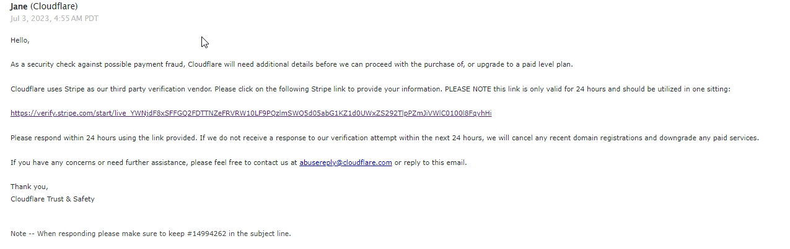
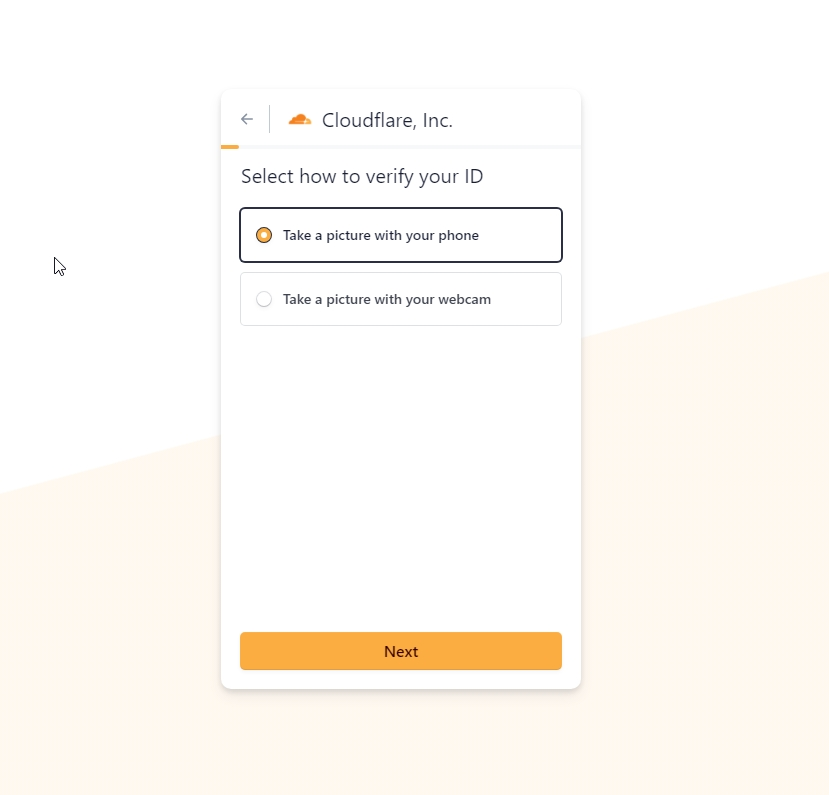

### Cloudflare-Firewall

A look into protecting your website with my Cloudflare Free Firewall Rules Plan

## Firewall Rules: 

Rule Name | File Name | Action | What For
---- | ---- | ---- | ----
General (UPDATED!) | [rules.ssl](./rules.ssl) | Manually Add | Peformance, User Experience, DDOS Protection, Crawlers 
Common Country (UPDATED!) | [common-country.rules](./common-country.rules) | Block | Only Allow Country's Who Won't Pass Much Malicous Traffic. 
Good ASN List (NEW!) | [asn.rules](./asn.rules) | Manage Challenge | Captcha Good ASN List Of Most Known Proxyscraping Sites. 
Bad ASN List (UPDATED!) | [bad-asn.rules](./bad-asn.rules) | Block | Block Bad ASN List Of Most Known Proxyscraping Sites. 
Threat Score (UPDATED!) | [threatscore.rules](./threatscore.rules) | Block | Block Bad Threats Flagged By Cloudflare 
Request Method | [request-method.rules](./request-method.rules) | Block | Block POST & HEAD Request's Only Allow GET Request's Unless Needed. 
User Agents (NEW!) | [user-agents.rules](./user-agents.rules) | Block | Block Known User-Agents  
Expressions (Part 1) (NEW!) | [expressions.rules](./expressions.rules) | Block | This Expressions are highly recommended for Node.js applications based on frameworks like Express.  
Expressions (Part 2) (NEW!) | [expressions2.rules](./expressions2.rules) | Block | This Expressions are highly recommended for Node.js applications based on frameworks like Express.  

## Examples: 
 
 
 
 

### Sources:

-   [NexusGuard.com Thread Report 2018](https://www.nexusguard.com/hubfs/2019%20PTC/Nexusguard_Q3%202018%20Threat%20Report.pdf)
-   [CloudFlare DDoS Trends 2021](https://blog.cloudflare.com/ddos-attack-trends-for-2021-q2/)
-   [Bad ASNS List](https://github.com/brianhama/bad-asn-list/blob/master/bad-asn-list.csv)
-   [Archive Site Removal Guide](https://blog.reputationx.com/block-wayback-machine)

### ⚠️ Cloudflare now requires Photo ID via Stripe ⚠️

